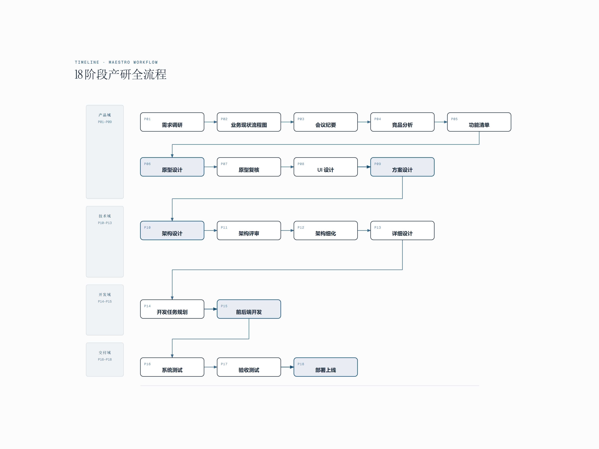
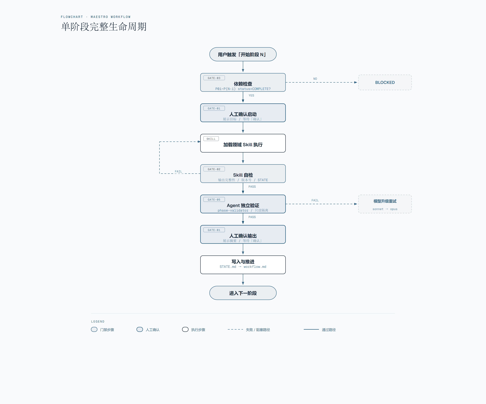

# Maestro

18 阶段产研全流程 AI 指挥家 — 从需求调研到部署上线，21 个 Skill + 20 个 Agent 协同编排。

## 概览

Maestro 是一个 Claude Code 插件，将完整的产研工作流（需求调研 → 部署上线）自动化。纯 Markdown Skills + Agent 定义，零运行时依赖。

**核心隐喻**：Maestro（指挥家）— 编排 18 阶段产研工作流，调度 20 个专业 Agent，协调 21 个领域 Skill，如同指挥家统领整个交响乐团。



## 安装

### 前提

- [Claude Code CLI](https://docs.anthropic.com/en/docs/claude-code) 已安装
- 无其他运行时依赖

### 快速安装（推荐）

一行命令安装 Maestro：

```bash
node -e "const{execSync}=require('child_process');const t=require('os').tmpdir();const p=require('path').join(t,'maestro-install');execSync('git clone https://github.com/lyuxiaohei/Maestro.git '+p,{stdio:'inherit'});execSync('node '+p+'/scripts/install.js',{stdio:'inherit'})"
```

或手动安装：

```bash
git clone https://github.com/lyuxiaohei/Maestro.git
cd Maestro
node scripts/install.js
```

### 项目级注册

在目标项目的 `.claude/settings.json` 中添加：

```json
{
  "projects": {
    "/your/project": {
      "plugins": ["/path/to/Maestro"]
    }
  }
}
```

### 首次使用

启动 Claude Code 后输入 `/workflow-engine {slug}` 创建或继续工作流（slug 为工作流标识，如 `user-center`），自动创建多工作流状态文件：

```
.planning/
└── workflows/
    └── {slug}/                          # 每条工作流独立目录
        ├── workflow.md                  # 工作流全局状态（6 域分组阶段总览）
        └── phases/
            ├── product/                 # P01-P04 需求域
            ├── design/                  # P05-P08 设计域
            ├── architecture/            # P09-P13 架构域
            ├── development/             # P14-P15 开发域
            ├── testing/                 # P16-P17 测试域
            └── deployment/              # P18 部署域
```

之后每次新会话启动时，SessionStart Hook 自动报告当前进度。

## 18 阶段工作流

| 阶段 | 名称 | Skill |
|------|------|-------|
| P01 | 需求调研 | meeting-minutes |
| P02 | 业务现状流程图 | diagram-design |
| P03 | 会议纪要 | meeting-minutes |
| P04 | 竞品分析 | competitive-analysis |
| P05 | 功能清单 | feature-list |
| P06 | 原型设计 | prototype-design + logic-list-spec |
| P07 | 原型复核 | prototype-review |
| P08 | UI 设计 | ui-design |
| P09 | 方案设计 | logic-list-spec (Draft) |
| P10 | 架构设计 | architecture-design |
| P11 | 架构评审 | architecture-review |
| P12 | 架构细化 | architecture-refinement |
| P13 | 详细设计 | detailed-design |
| P14 | 开发任务规划 | dev-task-planner |
| P15 | 前后端开发 | frontend-dev + backend-dev + code-review |
| P16 | 系统测试 | test-engineering |
| P17 | 验收测试 | acceptance-testing |
| P18 | 部署上线 | deployment |

### 最小闭环链路

```
diagram-design → logic-list-spec(Draft) → prototype-design → logic-list-spec(Extract) → prd-auto-generator
```

## 20 个 Agent

| Agent | 域 | 模型 | 职责 |
|-------|-----|------|------|
| phase-executor | 调度 | sonnet | 独立上下文执行阶段任务 |
| phase-validator | 调度 | sonnet | 独立验证阶段输出质量 |
| phase-planner | 调度 | sonnet | 规划阶段任务，分解目标和依赖 |
| plan-checker | 调度 | sonnet | 校验计划质量（只读） |
| research-synthesizer | 调度 | sonnet | 合并多个 researcher 输出 |
| doc-classifier | 调度 | sonnet | 文档自动分类（ADR/PRD/SPEC/DOC） |
| doc-synthesizer | 调度 | sonnet | 多文档合并、冲突检测 |
| doc-writer | 调度 | sonnet | 按模板生成/更新项目文档 |
| doc-verifier | 调度 | sonnet | 校验文档与代码库一致性 |
| domain-researcher | 产品 | sonnet | 调研项目领域背景 |
| competitive-researcher | 产品 | sonnet | Web 搜索竞品信息 |
| requirement-analyst | 产品 | sonnet | 结构化需求分析 |
| prototype-reviewer | 设计 | sonnet | 原型多维度复核 |
| architecture-reviewer | 架构 | opus | 架构技术审查（深度推理） |
| frontend-engineer | 前端 | sonnet | 前端代码审核 |
| backend-engineer | 后端 | sonnet | 后端代码审核 |
| test-engineer | 测试 | sonnet | 测试覆盖度和质量审核 |
| ops | 运维 | sonnet | 部署方案和环境审核 |
| security-reviewer | 安全 | sonnet | OWASP Top 10 安全审计 |
| integration-reviewer | 测试 | sonnet | 跨模块集成验证 |

## 5 条铁律门禁

```
阶段启动 → GATE-03（依赖检查）→ GATE-01（人工确认启动）
  → Skill 执行 → GATE-02（自检）→ GATE-05（Agent 验证）
  → GATE-01（人工确认输出）→ 推进下一阶段
```



| 门禁 | 名称 | 作用 |
|------|------|------|
| GATE-01 | 人工确认门禁 | 阶段启动/输出需用户明确确认 |
| GATE-02 | 自检门禁 | Skill 执行自检清单，不通过无法提交 |
| GATE-03 | 依赖门禁 | 上游阶段未完成时拒绝执行（用户可确认跳过） |
| GATE-04 | 中断保护门禁 | 会话中断后状态持久化，可从断点恢复 |
| GATE-05 | Agent 验证门禁 | phase-validator 独立验证输出质量 |

## 项目结构

```
maestro/
├── .claude-plugin/
│   └── plugin.json                 # 插件清单
├── skills/                         # 22 个 Skill（21 领域 + 1 编排器）
│   ├── workflow-engine/            #   中央编排器
│   │   ├── SKILL.md
│   │   └── references/             #   5 个参考文件
│   ├── diagram-design/             #   流程图/架构图（14 种图表）
│   ├── logic-list-spec/            #   业务逻辑清单（双模式）
│   ├── prototype-design/           #   原型 HTML（双模式 + 双规范）
│   ├── prd-auto-generator/         #   PRD 自动生成
│   ├── competitive-analysis/       #   竞品分析
│   ├── meeting-minutes/            #   会议纪要
│   ├── feature-list/               #   功能清单
│   ├── prototype-review/           #   原型复核
│   ├── ui-design/                  #   UI 设计
│   ├── architecture-design/        #   架构设计
│   ├── architecture-review/        #   架构评审
│   ├── architecture-refinement/    #   架构细化
│   ├── detailed-design/            #   详细设计
│   ├── dev-task-planner/           #   开发任务规划
│   ├── frontend-dev/               #   前端开发
│   ├── backend-dev/                #   后端开发
│   ├── code-review/                #   代码审核
│   ├── test-engineering/           #   测试工程
│   ├── training-materials/         #   培训材料
│   ├── acceptance-testing/         #   验收测试
│   └── deployment/                 #   部署上线
├── agents/                         # Agent 定义（按域分类）
│   ├── orchestrator/               #   调度域：executor, validator, planner, checker, synthesizer, doc×4 (9)
│   └── domain/                     #   项目域：researcher, reviewer, engineer, security, integration 等 11 个
├── hooks/
│   └── hooks.json                  # 6 个 Hook 注册
├── scripts/                        # Hook 脚本（6 个）
└── docs/                           # README 引用图片
```

## 常用命令

| 命令 | 说明 |
|------|------|
| `/workflow-engine {slug}` | 创建或继续指定工作流（无参数时列出已有工作流） |
| `开始阶段 N` | 推进到指定阶段 |
| `跳过阶段 N` | 跳过指定阶段（需确认原因，可提供替代输入） |
| `查看工作流状态` | 报告当前进度 |

## 开发者命令

| 命令 | 说明 |
|------|------|
| `node scripts/release.js` | 同步到公开仓库 |
| `node scripts/release.js --dry-run` | 预览同步内容 |
| `node scripts/install.js` | 本地全局安装 |
| `node scripts/install.js --from-github` | 从 GitHub 安装 |
| `node scripts/install.js --uninstall` | 卸载全局注册 |
| `node scripts/install.js --local` | 仅注册当前项目 |

## Hook 系统

Maestro 内置 6 个 Claude Code Hook，覆盖安全防护、上下文监控、提交校验、阶段边界检测和会话状态注入。所有 Hook 使用纯 Node.js 脚本，零外部依赖。

| Hook | 触发事件 | 功能 | 默认状态 |
|------|---------|------|---------|
| prompt-guard | PreToolUse Write\|Edit | 注入防护（扫描 .planning/ 写入内容） | 默认启用 |
| read-injection-scanner | PostToolUse Read | 读取内容注入扫描 | 默认启用 |
| validate-commit | PreToolUse Bash | Conventional Commits 格式校验 | 默认关闭（opt-in） |
| phase-boundary | PostToolUse Write\|Edit | 阶段状态文件变更检测 | 默认启用 |
| context-monitor | PostToolUse Write\|Edit | 上下文写入量监控 | 默认启用 |
| session-state | SessionStart | 会话启动时注入工作流状态 | 始终启用 |

配置示例（`.planning/config.json` hooks 节）：

```json
{
  "hooks": {
    "injection_guard": true,
    "read_scanner": true,
    "commit_validation": false,
    "phase_boundary": true,
    "context_warnings": true,
    "context_thresholds": {
      "soft": 204800,
      "hard": 512000,
      "critical": 1048576
    }
  }
}
```

## 技术约束

- 纯 Markdown Skills + Agent 定义 + Hook 脚本，零外部依赖
- SKILL.md 控制在 150 行内，细节放 `references/`
- 编排器单次不同时加载超过 2-3 个 Skill
- 已有 Skill 复制而非修改（保持原始文件不动）

## 许可证

All Rights Reserved. 本项目代码公开可见，但未授予任何使用、复制、修改或分发许可。
