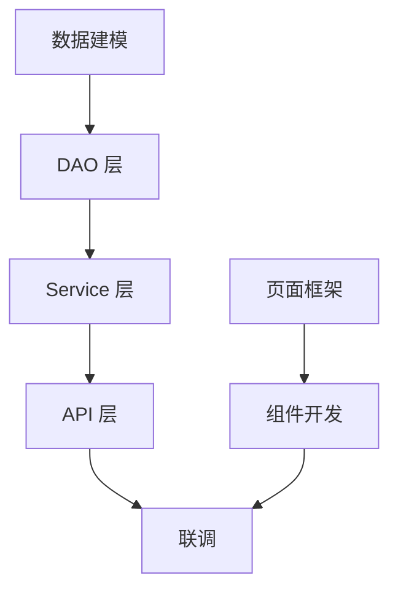

# 开发任务拆解模板

## 任务清单格式

```markdown
| 任务编号 | 任务名称 | 模块 | 类型 | 优先级 | 预计工时 | 负责人 | 前置依赖 | 状态 |
|---------|---------|------|------|--------|---------|--------|---------|------|
| T-001   |         |      |      |        |         |        |         | 待开发 |
```

## 任务类型

- **data** — 数据建模（建表、索引、数据迁移）
- **api** — 接口层（Controller、路由定义）
- **service** — 服务层（业务逻辑）
- **dao** — 持久层（Repository、Mapper）
- **middleware** — 中间件（缓存、消息队列、定时任务）
- **page** — 页面开发（路由、组件、交互）
- **integration** — 联调任务（前后端对接）
- **test** — 测试任务（单元测试、接口测试）

## 依赖关系图格式

使用 Mermaid 语法：



## 里程碑定义格式

```markdown
| 里程碑 | 日期 | 交付物 | 验收标准 |
|--------|------|--------|---------|
| M1: 数据层完成 | YYYY-MM-DD | 建表脚本、DAO 层 | 全部表创建成功、CRUD 测试通过 |
| M2: 后端接口完成 | YYYY-MM-DD | API 接口文档 | Swagger 文档生成、接口测试通过 |
| M3: 前端页面完成 | YYYY-MM-DD | 前端页面 | 页面渲染正确、交互可用 |
| M4: 联调完成 | YYYY-MM-DD | 联调记录 | 全部接口联调通过 |
```
